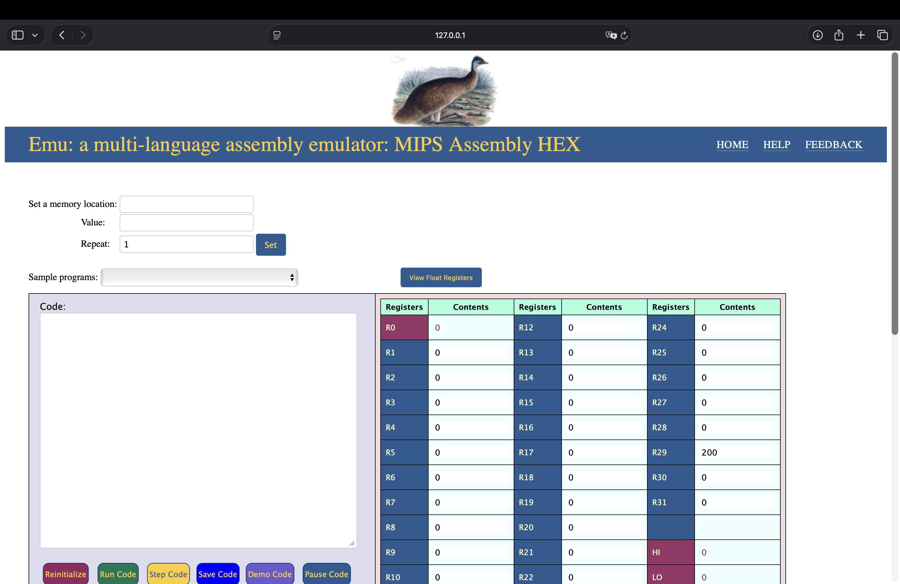

<div align="center">
  <h1>🖥️ Emu86</h1>
  <p><strong>An interactive x86 assembly emulator for education</strong></p>
  <p>Learn assembly language through hands-on practice — in your browser or Jupyter notebooks</p>

  <p>
    <a href="https://github.com/Emu86Dev/Emu86/actions"></a>
    <a href="https://pypi.org/project/emu86/"></a>
    
    <a href="https://emu86.pythonanywhere.com"></a>
  </p>

  <p>
    <a href="https://emu86.pythonanywhere.com">🚀 Try Live Demo</a> •
    <a href="#quick-start">Quick Start</a> •
    <a href="#jupyter-notebooks">Jupyter Notebooks</a> •
    <a href="#supported-architectures">Architectures</a>
  </p>
</div>

---

## ✨ Features

- **🌐 Web-Based Emulator** — No installation needed, runs entirely in your browser
- **📓 Jupyter Integration** — Use Emu86 kernels in Jupyter notebooks for interactive learning
- **🏗️ Multi-Architecture Support** — Intel x86, AT&T syntax, MIPS, and RISC-V
- **📊 Visual Debugging** — Watch registers and memory change in real-time as you step through code
- **📝 Sample Programs** — Pre-loaded examples covering loops, arrays, arithmetic, and more
- **🎓 Education-First Design** — Built specifically for teaching assembly language concepts

## 📸 Screenshots

<p align="center">
  
</p>

## 🚀 Quick Start

### Option 1: Use the Live Demo (Easiest)

Visit **[emu86.pythonanywhere.com](https://emu86.pythonanywhere.com)** — no installation required!

### Option 2: Run Locally

```bash
# Clone the repository
git clone https://github.com/Emu86Dev/Emu86.git
cd Emu86

# Create and activate virtual environment
source venv.sh

# Install dependencies
make dev_env

# Start the development server
make dev
```

Then open `http://localhost:8000` in your browser.

### Option 3: Docker

```bash
# Build and run with Docker Compose
docker-compose up

# Or run the container directly
./container.sh
```

## 📓 Jupyter Notebooks

Emu86 can be used as a Jupyter kernel for interactive assembly programming:

```bash
# Install the package
pip install emu86

# Install your preferred kernel (intel, att, mips_asm, mips_mml, or riscv)
python -m kernels.intel.install

# Launch Jupyter
jupyter notebook
```

Then create a new notebook and select the "Intel" (or your chosen architecture) kernel.

**Resources:**
- [Assembly Language Tutorial Notebook](https://github.com/gcallah/Emu86/blob/master/kernels/Introduction%20to%20Assembly%20Language%20Tutorial.ipynb)
- [Jupyter Kernel Setup Guide](kernels/README.md)

## 🏗️ Supported Architectures

| Architecture | Syntax Style | Kernel Name |
|--------------|--------------|-------------|
| **Intel x86** | Intel | `intel` |
| **x86** | AT&T | `att` |
| **MIPS** | Assembly | `mips_asm` |
| **MIPS** | MML | `mips_mml` |
| **RISC-V** | Assembly | `riscv` |

## 🎯 Use Cases

- **Computer Architecture Courses** — Teach CPU concepts with hands-on assembly coding
- **Operating Systems Classes** — Understand low-level system operations
- **Self-Learning** — Practice assembly language without complex toolchain setup
- **Interview Prep** — Review assembly concepts for systems programming interviews

## 🛠️ Development

```bash
# Run all tests
make tests

# Run linting
make lint

# Build help documentation
make help_html
```

## 🗺️ Roadmap

See [ProgressAndGoals.md](ProgressAndGoals.md) for current development status and upcoming features:

- [ ] WASM support revival
- [ ] Local program upload feature
- [ ] UI improvements for registers and error sections
- [ ] Performance optimizations with AJAX

## 🤝 Contributing

Contributions are welcome! Here's how to get started:

1. Fork the repository
2. Create a feature branch (`git checkout -b feature/amazing-feature`)
3. Make your changes and run tests (`make tests`)
4. Commit your changes (`git commit -m 'Add amazing feature'`)
5. Push to the branch (`git push origin feature/amazing-feature`)
6. Open a Pull Request

## 📚 Related Resources

- [Emu86 Jupyter Kernel on PyPI](https://pypi.org/project/emu86/)
- [ASM Comment Shortcut Extension](https://github.com/sx563/ASM_Comment_Shortcut) — Jupyter keyboard shortcuts for Emu86

## 🙏 Acknowledgments

Originally created in 2019, Emu86 is actively maintained and improved by a community of contributors dedicated to making assembly language education accessible.

---

<p align="center">
  <sub>📄 README optimized with <a href="https://gingiris.github.io/github-readme-generator/">Gingiris README Generator</a></sub>
</p>
